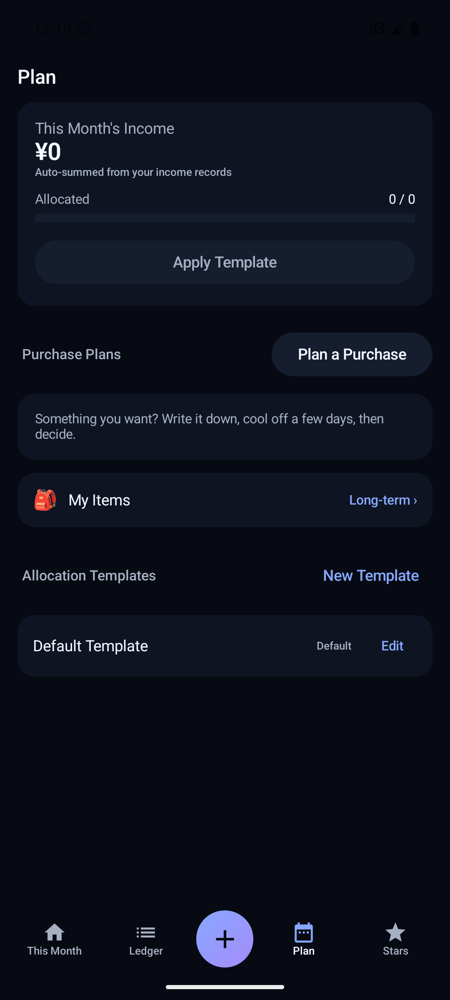
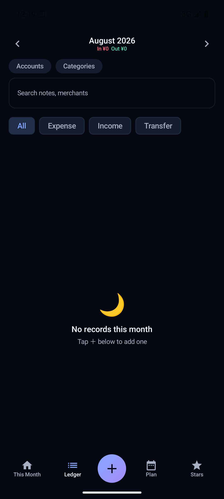
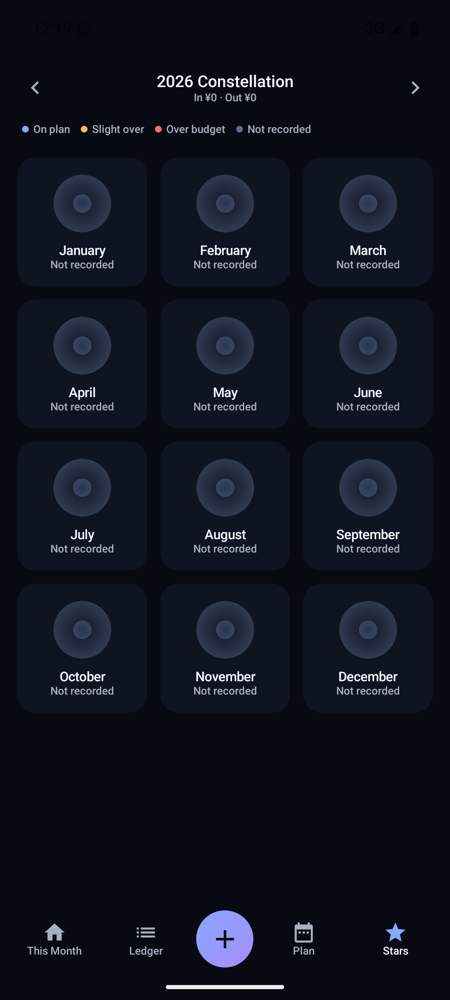
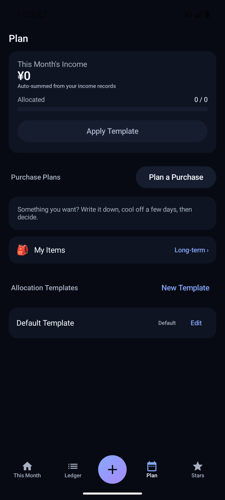

# 星图账本 · StarLedger ⭐

> **让每一笔收支，都有自己的轨道。**
> *Every expense finds its own orbit.*

一款免费、开源、离线优先的个人记账与生活费规划 App。

<p align="center">
  
  
  
  
</p>

---

## 这是什么

**星图账本**是一款安静、不打扰的记账工具。它不只是记录每一笔收支，更把你的钱变成一颗颗可以回望的「恒星」——每个月一颗，一年十二颗，组成属于你的「星座」。

所有数据只保存在手机本地：**无需登录、无广告、不联网**。

## 界面预览

| 本期 | 记账 | 星图 | 规划 |
|:---:|:---:|:---:|:---:|
|  |  |  |  |

## 核心功能

- 📝 **快速记账** —— 支出 / 收入 / 转账，五秒记一笔
- 💰 **生活费分配** —— 把收入按模板分配到各分类，实时查看每类还剩多少
- 🛡️ **大额消费冷静期** —— 想买的东西先「冷静」几天再决定，避免冲动消费
- ⭐ **星图系统** —— 每月生成一颗「恒星」，一年组成年度「星座」
- 🌙 **月末复盘** —— 预算偏差、结余处理（结转下期 / 归入缓冲 / 保留）
- 💾 **备份** —— JSON 全量导入导出、CSV 账单导出
- 🌐 **双语** —— 简体中文 / English
- 🔒 **隐私优先** —— 数据只存本地，无账号、无广告、无网络请求

## 安装

> 暂未上架应用商店，目前需要从源码构建。

```bash
# 构建调试版 APK
./gradlew assembleDebug
```

产物在 `app/build/outputs/apk/debug/app-debug.apk`，安装到 Android 8.0（API 26）及以上即可。

## 从源码构建

环境要求：JDK 17+、Android SDK（compileSdk 35）

```bash
git clone https://github.com/<你的用户名>/StarLedger.git
cd StarLedger
./gradlew assembleDebug
```

运行单元测试：

```bash
./gradlew testDebugUnitTest
```

## 技术栈

Kotlin · Jetpack Compose · MVVM · Room · Hilt · DataStore · Coroutines · Navigation Compose

## 许可证

本项目使用 [GPL-3.0-or-later](LICENSE) 许可证。

## 贡献

欢迎任何形式的贡献，请先阅读 [CONTRIBUTING.md](CONTRIBUTING.md) 与 [行为准则](CODE_OF_CONDUCT.md)。

---

<p align="center">⭐ 如果这个项目对你有用，欢迎点个 Star 支持一下。</p>
